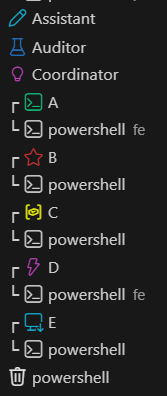

-green)


# Vinci's CC-Harness

Multi-terminal coordination for Claude Code. You open several terminals, assign each one a role, and they coordinate through markdown files. No plugins, no server, no infrastructure — just files that Claude Code reads on startup.

<p align="center">
  
  <br />
  <em>A typical sprint layout — Coordinator, two Workers, and an Auditor each in their own terminal.</em>
</p>

---

## How It Works

A sprint goes like this:

1. You open a Claude Code terminal and tell it "You are the Coordinator."
2. The Coordinator reads `CLAUDE.md`, then plans the sprint — what gets built, who does what.
3. The Coordinator writes a SESSION-PROMPT for each worker. These are self-contained markdown files with the task, context, and rules.
4. You open new terminals (one per worker) and paste "Read SESSION-PROMPT-A.md".
5. Each worker runs in its own git worktree — isolated branch, no conflicts.
6. Workers implement, commit, and write a short report when done.
7. The Coordinator merges each worker branch back to main, one at a time.
8. Optionally, an Auditor reviews what happened and writes a retro.
9. Learnings get saved to memory files so the next sprint starts smarter.

All coordination happens through files in `.sprint/` and `memory/`. No shared context windows, no API calls between terminals.

### Roles

| Role | What it does | How many |
|------|-------------|----------|
| **Coordinator** | Plans the sprint, writes worker prompts, merges branches | 1 |
| **Worker** | Implements code in an isolated git worktree | 1–5 |
| **Auditor** | Reviews quality, writes retros, improves the harness | 1 (optional) |
| **Assistant** | Deploys, runs builds, answers questions | 1 (on-demand) |

---

## Quick Start

### 1. Install

```bash
git clone https://github.com/OpusPocusAI/Vincis-Harness.git
cp -r Vincis-Harness/harness/* your-project/
```

### 2. Configure

Edit `CLAUDE.md` in your project root. Add your services, ports, deploy commands, and code conventions. Claude Code reads this file automatically on every session start.

### 3. Run a sprint

```bash
# Terminal 1 — Coordinator
claude
# Paste: "You are the Coordinator. Read CLAUDE.md."

# Terminal 2 — Worker A
claude
# Paste: "Read .sprint/sprint-1/SESSION-PROMPT-A.md"

# Terminal 3 — Worker B (optional)
claude
# Paste: "Read .sprint/sprint-1/SESSION-PROMPT-B.md"
```

See the [Your First Sprint tutorial](docs/tutorials/01-your-first-sprint.md) for a full walkthrough.

---

## What makes it work

**Memory that persists.** The `memory/` folder holds topic files (payments, design, auth, whatever your project needs) and a decision register. Every user decision gets saved. Next sprint, the Coordinator and workers already know what was decided.

**Inbox for async messaging.** Roles talk to each other through `.sprint/inbox/` files. The Coordinator can leave notes for the Auditor. Workers can flag blockers. It's not real-time — it's a simple text-based mailbox that survives context clears.

**Plan-execute split.** Every role follows the same cycle: plan mode, write a plan file, get user approval, context clears, execute mode. The execute phase has zero prior context — it only sees the plan file. This prevents context blowout on long sprints.

**Lite mode for simple tasks.** Not every worker needs the full ceremony. Lite mode gives workers a self-contained prompt with everything inline — no plan mode, no role doc reads. Saves ~45-55% tokens. The Coordinator picks Standard or Lite per worker.

**Git worktrees for isolation.** Each worker gets its own worktree and branch. No merge conflicts during the sprint. The Coordinator merges one branch at a time afterward.

**Templates for everything.** Plan templates, session prompts, session logs, worker reports, coordinator logs. Every artifact has a structure so nothing important gets skipped.

Context Intelligence is also available — it maps your codebase dependencies to help the Coordinator write more targeted prompts. Optional. See the docs if you're curious.

---

## What's Included

```
your-project/
├── CLAUDE.md                       # Master rules file (auto-loaded every session)
├── GETTING-STARTED.md              # Guide that Claude Code reads on first setup
├── .sprint/
│   ├── roles/
│   │   ├── COORDINATOR-ROLE.md     # Coordinator protocol
│   │   ├── WORKER-ROLE.md          # Worker protocol
│   │   ├── AUDITOR-ROLE.md         # Auditor protocol
│   │   └── ASSISTANT-ROLE.md       # Assistant protocol
│   ├── inbox/                      # Inter-role messaging
│   ├── context/                    # Context Intelligence (optional)
│   └── sprint-1/                   # Sprint artifacts (created per sprint)
├── .claude/
│   ├── templates/                  # Plan and artifact templates
│   └── skills/                     # Custom skills
└── memory/
    ├── MEMORY.md                   # Memory index (auto-loaded)
    ├── sprint-process.md           # Sprint learnings
    ├── user-decisions.md           # Decision register
    └── {topic}.md                  # Your project's topic files
```

---

## Documentation

| Topic | File |
|-------|------|
| Your first sprint (step-by-step) | [`docs/tutorials/01-your-first-sprint.md`](docs/tutorials/01-your-first-sprint.md) |
| Self-explaining guide (Claude reads this) | [`harness/GETTING-STARTED.md`](harness/GETTING-STARTED.md) |
| Full changelog (v1 through v4.4) | [`CHANGELOG.md`](CHANGELOG.md) |

---

## Background

This harness was built over 19 sprints on [CityWijse](https://www.citywijse.com), an Amsterdam experiences platform. It started because multi-terminal Claude Code sessions kept hitting the same problems: workers committing on main instead of their branch, context windows blowing out mid-sprint, user decisions getting lost between sessions, and vague prompts leading to wasted worker cycles.

Each version fixed something specific. v1 added roles and the inbox. v2 added memory and branch hooks. v3 got workers into worktrees. v4 made process steps indistinguishable from code tasks (which finally got compliance above 90%). Lite mode came in v4.1 to cut token costs for straightforward tasks.

It's not perfect. Some sprints still need manual intervention, and the Auditor role is more useful on complex sprints than simple ones. But the core loop — plan, delegate, implement, merge — is stable and repeatable. The full history is in the [CHANGELOG](CHANGELOG.md).

---

## Things to know

- **Plans go through SESSION-PROMPTs.** Don't paste a plan directly into a worker terminal. The Coordinator writes SESSION-PROMPTs — that's the only activation path for workers.
- **One worker, one task.** If a worker would need to read more than ~2000 lines of source, split it into two workers.
- **Workers must commit.** Uncommitted work dies when the terminal closes.
- **Save decisions to files.** If a user says "use Stripe not Mollie," that goes in `memory/user-decisions.md`. Decisions that only exist in conversation context will be lost.

---

## FAQ

**Do I need multiple Claude Code subscriptions?**
No. You open multiple terminals from the same installation. Each terminal is its own context window.

**How many workers should I run?**
Start with 1–2. The harness has been tested with up to 5. More workers means more merge complexity, so only add them when you have genuinely parallel tasks.

**Can I skip the sprint ceremonies?**
Yes. The Coordinator and Worker roles work for any structured task. The full sprint ceremony (contract, board, audit) is optional.

**Does this work with Cursor or Windsurf?**
No. It's built for Claude Code specifically — the roles, skills, and plan-execute cycle depend on how Claude Code handles `CLAUDE.md` and context windows.

---

## Contributing

Contributions welcome. Please:
1. Open an issue describing the change
2. Follow the existing markdown structure
3. Test with at least one sprint cycle before submitting

---

## License

Free to use, modify, and learn from. Cannot be sold, sublicensed, or claimed as someone else's work. See [LICENSE](LICENSE) for full terms.

---

Built by [OpusPocusAI](https://github.com/OpusPocusAI).
